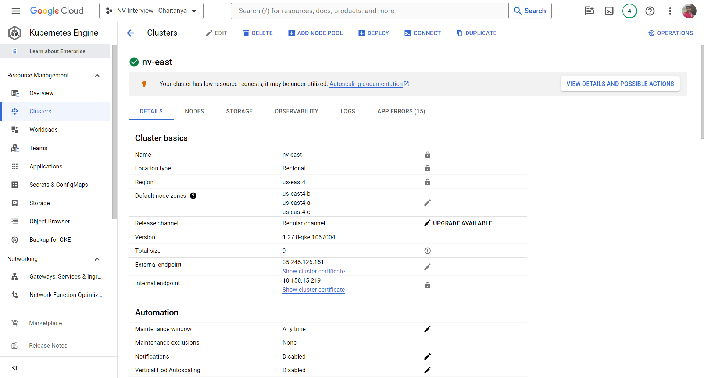
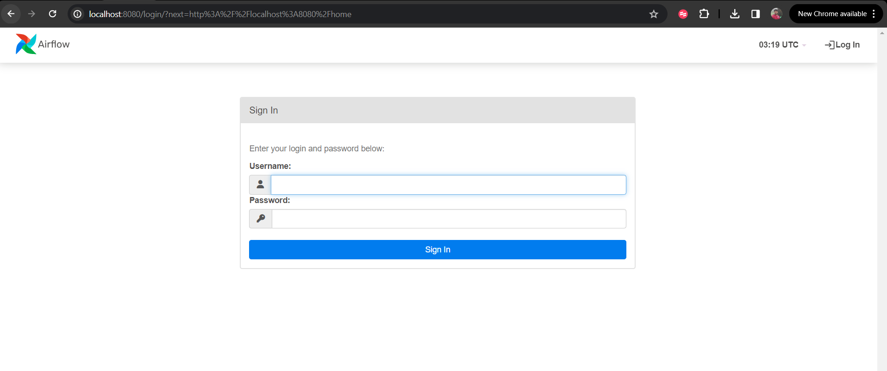
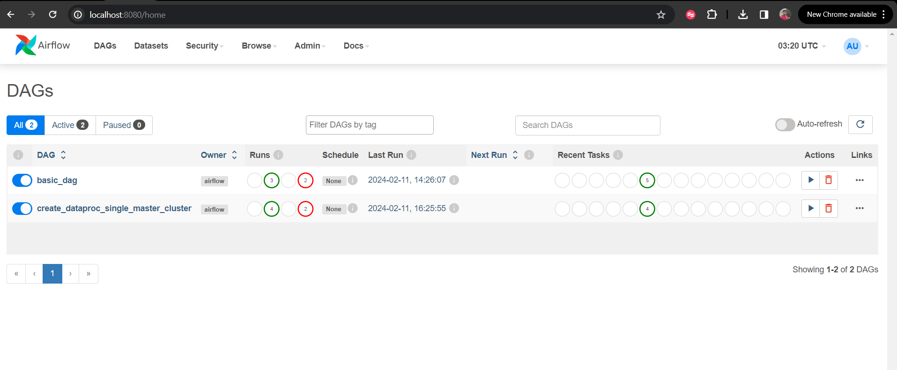
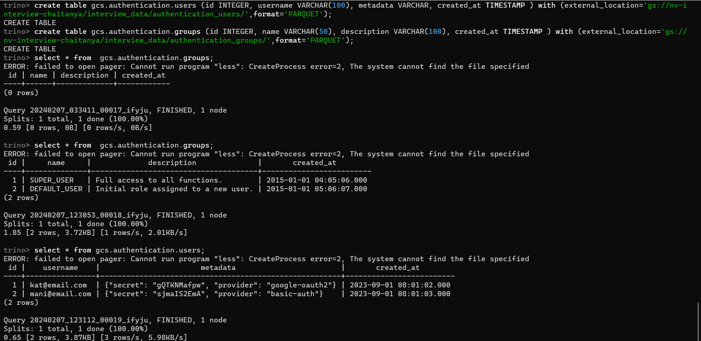
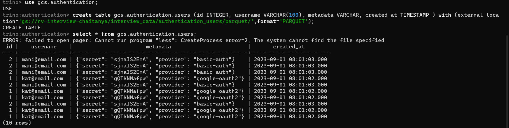
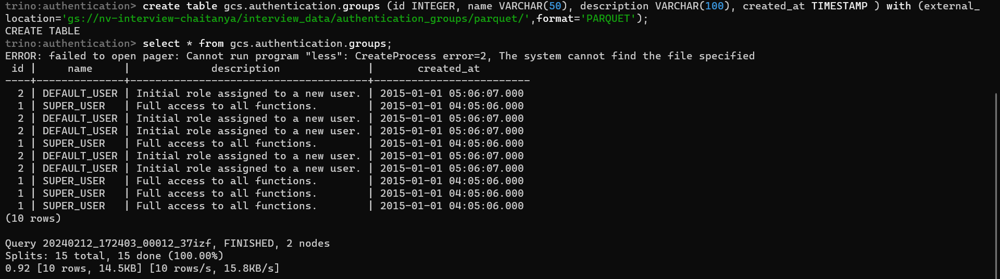
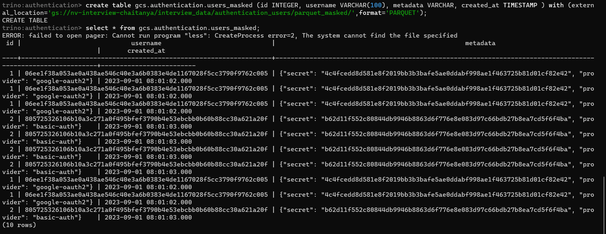
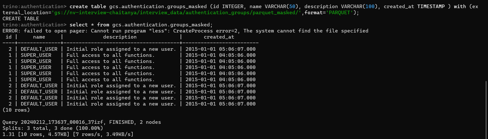
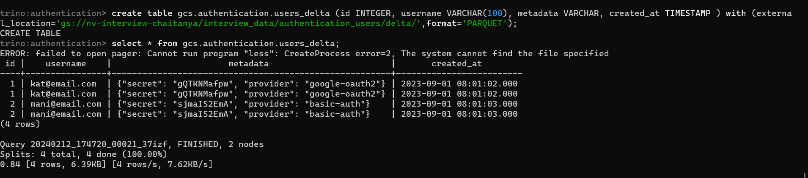
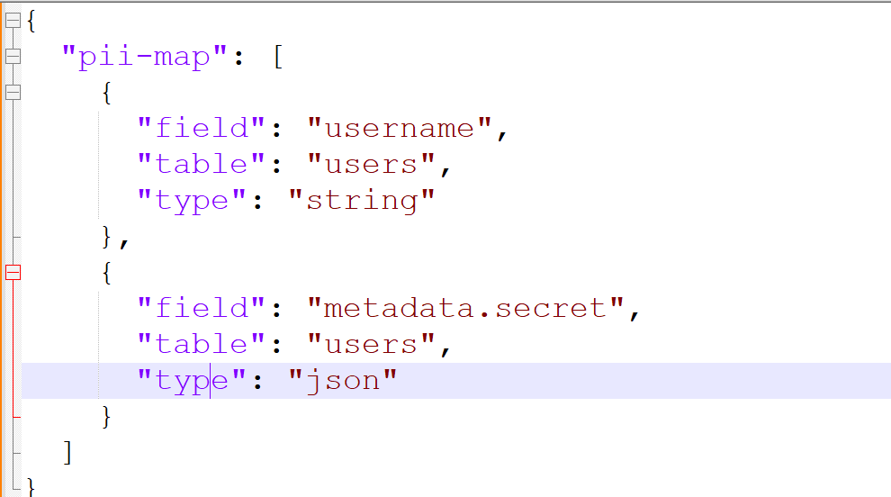

# nv-interview-chaitanya-terraform

## Terraform folders
1. [environments](environments)  This directory holds configurations for different environments like development, staging, and production. Each environment has its own set of Terraform configuration files (main.tf, variables.tf, outputs.tf, terraform.tfvars).
2. [modules](modules) This directory contains reusable modules for different components of infrastructure. Each module has its own directory with main.tf, variables.tf, and outputs.tf defining the module's functionality.
3. [images](images) This directory contains the docker images details for the infra, this is to be used along with CI CD, and any artifactory such as jfrog or gcr etc.. ___currently this is a placeholder___

## Kubernetes deployment

1. For creating kubernetes cluster below components are needed
    1. Node pools
    2. Networks (VPC, NAT, SUBNET) 
    3. Enabling of GCP services, Service account creation
    4. For this assessment scope, went ahead using default network.
2. Workload identity federation has been enabled for seamless authentication, 
3. Service account creation and binding to Workload federation has been attempted.
4. Config map with pii fields info has been created in airflow-ns namespace.

## Airflow deployment
- Git [repo](https://github.com/c-14795/nv-airflow-dags/tree/master) is used for dags sync.
- Port forwarding is used, instead of load balancer.
- Default user admin is used, no other users are created. 
- ### Images
  - 
  - #### Dags shown in below screenshot, code an be found in the repo link above.
    - 
  - **basic_dag** is a dag which is used for testing..
  - **create_dataproc_single_master** is the dag which 
    - creates a dataproc cluster
    - Inserts sample data into the gcs location (**_spark job_**)
    - Reads the pii mapping and generates the masked data (**_spark job_**)
    - Generates the delta format for both masked data and normal data (**_spark job_**)
    - The code for jobs is kept in this [repo] (https://github.com/c-14795/nv-spark-jobs/tree/master)
    - As a best practice A CI CD pipeline will zip the code and put it in gcs repo for pyspark to pickup.
    

## Trino deployment
- Dataproc serverless metastore is considered as hive metastore
- Port forwarding is used, instead of load balancer.
### created the data and read from trino

## Task details
1. An attempt has been made to read the config map pii fields in airflow, which has been unsuccessful.
2. To ensure the dynamic nature PII fields has been added as a variable to airflow and passed to the job.
   1. Structure of pii map goes below
      
      1. field represents column,
      2. table represents on which dataset the pii mapper should be applied
      3. type represents the data type, of column
         1. If it is a string, it is straight forward
         2. if it is json, we have to give a parsable path, works only with json without array paths
         3. A generic function has been implemented to understand this mapper, present [here](https://github.com/c-14795/nv-spark-jobs/blob/master/mask_pii.py#L83) 
         4. We can implement many custom types and move forward for nested / much complex data fields with this approach. 